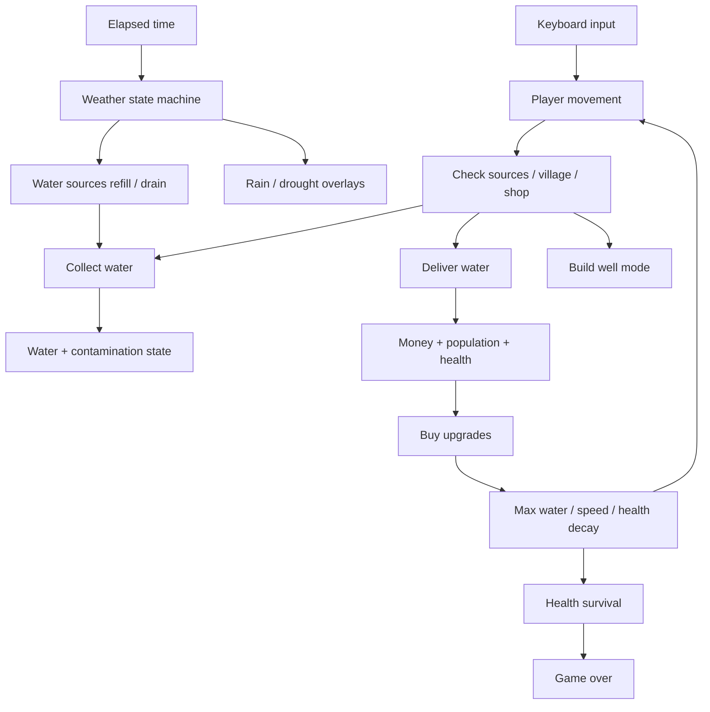

# Gameplay Map

This file maps the core gameplay variables in [src/app/components/WaterGame.tsx](src/app/components/WaterGame.tsx) and how they interact during play.

## Core Loop

## State Layers

### 1. World constants

These never change during play unless you edit the code.

- `WORLD_W`, `WORLD_H`: map size.
- `BASE_SPEED`: base player speed.
- `BASE_MAX_WATER`: base bucket capacity.
- `COLLECT_RATE`: how much water is taken per frame when near a source.
- `HEALTH_DECAY`: base health loss per second.
- `WATER_DECAY`: passive water loss per frame while carrying water.
- `POP_PER_DELIVERY`: population gained from a clean delivery.
- `DONATION_PER_PERSON_PER_DAY`: money earned per person per day.
- `DAY_DURATION`: seconds in a full day.
- `DELIVER_RADIUS`, `COLLECT_RADIUS`, `SHOP_RADIUS`: interaction distances.
- `WELL_COST`: cost to build a well.
- `CONTAM_HEALTH_PENALTY`, `CONTAM_WATER_PENALTY`: contamination damage.
- `RAIN_WELL_FILL_RATE`, `RAIN_RIVER_FILL_RATE`: weather refill rates.
- `DROUGHT_WELL_DRAIN_RATE`, `DROUGHT_RIVER_DRAIN_RATE`: weather drain rates.

### 2. Static upgrade list

Defined in `UPGRADES`.

- `filter`: prevents dirty-water penalties.
- `jug1`, `jug2`: increase `maxWater`.
- `speed1`, `speed2`: increase movement speed.
- `health1`: reduces `healthDecay`.

### 3. Persistent game state

Stored in `stateRef.current` as `GameState`.

#### Player

- `px`, `py`: current position.
- `facing`: left/right sprite direction.
- `walkFrame`, `walkTimer`: animation state.
- `speed`: computed from upgrades.
- `health`: survival meter.
- `water`: current collected water.
- `maxWater`: bucket capacity from upgrades.
- `bucketContaminated`: whether carried water is dirty.

#### Economy and progress

- `money`: current cash.
- `moneyFrac`: sub-cent accumulator used to add money smoothly.
- `population`: village size.
- `day`: current day count.
- `timeOfDay`: day progress from `0` to `1`.

#### Water network

- `sources`: active water sources.
- `builtWells`: player-built wells that persist across days.
- `collectingFrom`: source id being harvested right now.

#### State control

- `gameOver`: ends the simulation.
- `deliveryFlash`: flash effect after delivery.
- `lastTime`: timestamp used to compute frame delta.

#### Effects and particles

- `ripples`, `dusts`, `floatTexts`: visual effects.
- `rippleTimer`, `dustTimer`: spawn cadence.
- `lastRippleId`, `lastDustId`, `lastFloatId`: unique ids.

#### Shop and build mode

- `purchasedUpgrades`: owned upgrade ids.
- `nearShop`: proximity flag for opening shop.
- `buildMode`: whether well placement is active.

#### Weather system

- `weather`: `clear | rain | drought`.
- `weatherIntensity`: 0 to 1 transition strength.
- `weatherElapsed`: current weather elapsed time.
- `weatherDuration`: how long the current weather lasts.
- `nextWeatherTimer`: countdown until next weather event.
- `lightningFlash`: lightning screen flash.
- `lightningTimer`: countdown to next lightning burst.
- `droughtCracks`: cached crack overlays for drought.

## Derived Stats

These are computed from upgrades and copied back into state.

### `computeMaxWater(upgrades)`

- Starts at `BASE_MAX_WATER`.
- `jug1` adds `+50`.
- `jug2` adds `+100`.

### `computeSpeed(upgrades)`

- Starts at `BASE_SPEED`.
- `speed1` multiplies speed by `1.4`.
- `speed2` multiplies speed by `1.8`.

### `computeHealthDecay(upgrades)`

- Starts at `HEALTH_DECAY`.
- `health1` reduces decay to `55%` of base.

## System Interactions

### Movement

- Keyboard input updates `px` and `py`.
- Movement speed comes from `speed`.
- Diagonal movement is normalized so it is not faster than cardinal movement.
- Moving also:
  - increases `walkTimer` and `walkFrame`,
  - creates dust particles,
  - increases health decay slightly through the `moving ? 1.4 : 1` multiplier.

### Collection

- When player distance to a source is below `COLLECT_RADIUS`, water is taken.
- `COLLECT_RATE` is added to `water`.
- The same amount is removed from the source.
- If the source is contaminated and no filter is owned, `bucketContaminated = true`.
- Dirty water also drains health and slowly removes carried water through `CONTAM_WATER_PENALTY`.
- If `filter` is owned, contaminated collection no longer hurts.

### Delivery

- When the player is inside `DELIVER_RADIUS` of the village and has water:
  - all carried water is delivered,
  - `water` resets to `0`,
  - `bucketContaminated` resets to `false`,
  - `population` increases by `POP_PER_DELIVERY` if clean, or `1` if dirty,
  - `health` increases by delivered water amount, scaled down to `30%` if dirty,
  - `deliveryFlash` is triggered.
- Higher `population` increases future money income.

### Economy

- Every frame, money income is derived from:
  - `population * DONATION_PER_PERSON_PER_DAY / DAY_DURATION`.
- This is accumulated in `moneyFrac`.
- When `moneyFrac` reaches at least `0.01`, whole cents are added to `money`.
- `money` is then used for shop purchases and building wells.

### Shop

- `nearShop` becomes true when the player is within `SHOP_RADIUS` of the shop.
- `shopOpen` is UI state, not part of `GameState`.
- `handleBuy`:
  - checks money and prerequisites,
  - adds the upgrade to `purchasedUpgrades`,
  - subtracts the cost from `money`,
  - recomputes `maxWater`, `speed`, and `healthDecay`,
  - spawns a floating purchase message.

### Build mode

- `buildMode` toggles on `B`.
- While in build mode, pressing space attempts to place a well.
- `canPlaceWell()` blocks placement near the village, shop, or existing sources.
- If valid and the player has at least `WELL_COST`:
  - money is deducted,
  - a built well is added to `builtWells`,
  - a new source is appended to `sources`,
  - build mode turns off.

### Day cycle

- `timeOfDay` advances until it reaches `1`.
- `day` increments when `handleNewDay()` is used.
- `initState(prev)` carries forward:
  - `money`,
  - `population`,
  - `trees`,
  - `builtWells`,
  - `purchasedUpgrades`.
- A new day generates a fresh source layout using the carried wells.

### Weather

- `nextWeatherTimer` counts down during `clear` weather.
- When it reaches `0`, the game chooses `rain` or `drought`.
- Weather state sets `weatherElapsed`, `weatherDuration`, and resets intensity.
- During active weather:
  - `weatherIntensity` ramps in and out,
  - sources are refilled or drained,
  - drought may generate cracks,
  - rain may trigger lightning.
- On weather end, the game returns to `clear` and clears drought cracks.

### Source behavior under weather

- `rain`:
  - wells refill fastest,
  - rivers refill moderately,
  - puddles refill a little.
- `drought`:
  - wells drain,
  - rivers drain,
  - built wells drain more slowly than natural wells.

### Health and game over

- Health decreases every frame by `healthDecay`.
- Dirty water adds extra health loss.
- Delivering water restores health.
- If `health <= 0`, `gameOver = true`.
- Game over stops world updates and shows the overlay.

## UI State Mirror

`uiState` is a React state mirror of the simulation for HUD rendering.

- It copies selected values from `stateRef.current` each animation frame.
- It is used by `GameHUD` and `UpgradeShop`.
- It is not the source of truth for gameplay.

Important mirrored fields:

- `health`
- `water`
- `maxWater`
- `bucketContaminated`
- `hasFilter`
- `money`
- `donationRate`
- `population`
- `day`
- `timeOfDay`
- `gameOver`
- `nearShop`
- `purchasedUpgrades`
- `buildMode`
- `weather`
- `weatherIntensity`

## Input Map

- `WASD` / arrow keys: move.
- `E`: open shop when near the shop.
- `B`: toggle build mode.
- `Space`: place a well while in build mode.
- `Escape`: close shop and exit build mode.

## Practical Dependency Summary

- `upgrades` -> change `maxWater`, `speed`, `healthDecay`.
- `speed` -> changes movement and therefore collection/delivery timing.
- `population` -> changes donation income.
- `weather` -> changes water source availability and visuals.
- `water + contamination` -> changes survival and delivery quality.
- `builtWells` -> adds permanent sources across new days.

## Quick Reference Table

| Variable / System | Drives | Depends on |
| --- | --- | --- |
| `health` | survival, game over | `healthDecay`, contamination, delivery healing |
| `water` | delivery readiness, contamination drain | collection, decay, delivery |
| `maxWater` | capacity | upgrades `jug1`, `jug2` |
| `speed` | movement rate | upgrades `speed1`, `speed2` |
| `population` | donation rate | deliveries |
| `money` | purchases, well building | population, upgrade/shop decisions |
| `weather` | source refill/drain, overlays | timer/state machine |
| `sources` | collection opportunities | weather, built wells, day generation |
| `buildMode` | well placement flow | keyboard toggle, money, placement rules |
| `shopOpen` | purchase UI | proximity and key input |
